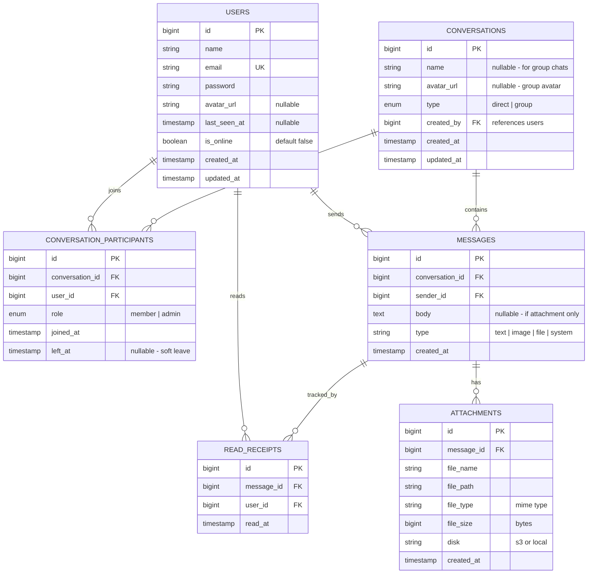
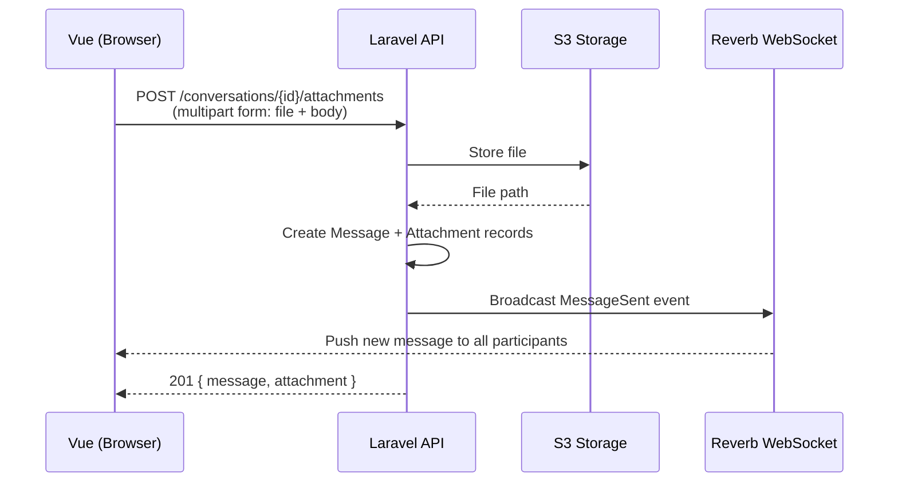
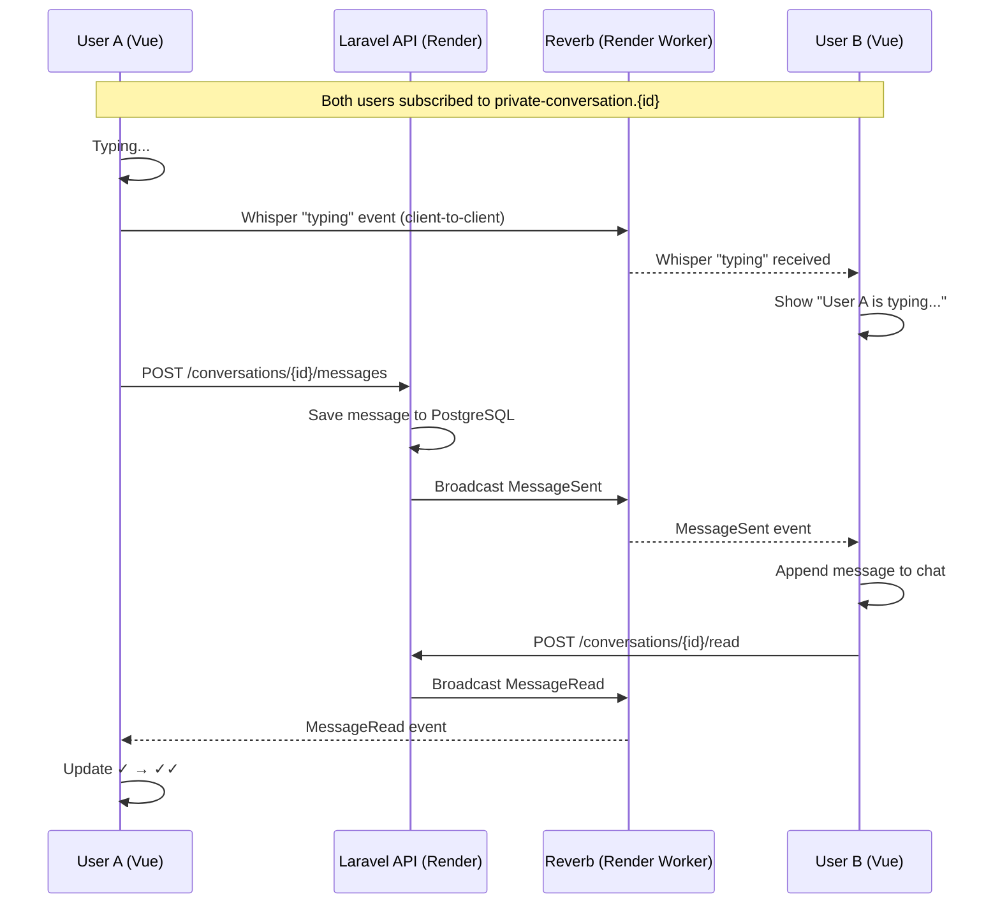
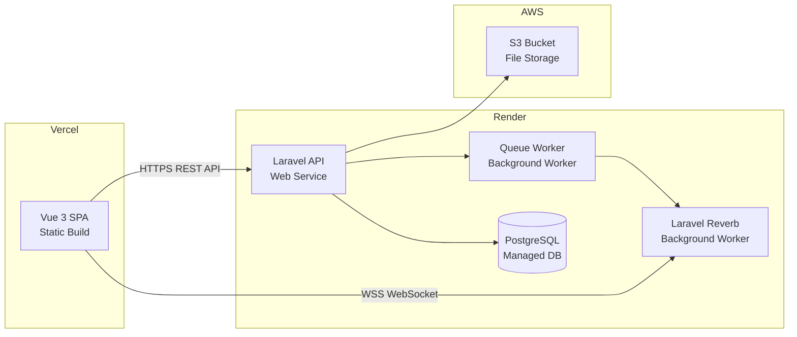

# Real-Time Chat Application — Implementation Plan

Build a full-featured real-time chat application with **group conversations**, **file sharing**, **online/typing indicators**, and **read receipts**.

---

## Tech Stack Summary

| Layer | Technology | Hosting | Purpose |
|:------|:-----------|:--------|:--------|
| **Backend API** | Laravel 11+ (PHP 8.2+) | **Render** (Web Service) | REST API, auth, broadcasting |
| **Frontend SPA** | Vue 3 + Vue Router + Pinia | **Vercel** | Standalone single-page app |
| **Database** | PostgreSQL 15+ | **Render** (Managed DB) | Persistent storage |
| **Real-Time** | Laravel Reverb + Laravel Echo | **Render** (Background Worker) | WebSocket server & client listener |
| **File Storage** | S3-compatible (Render Disk or AWS S3) | Cloud | Uploaded files & images |
| **Auth** | Laravel Sanctum (SPA mode) | — | Cookie/token-based API auth |
| **Queue** | Database driver → Redis | **Render** | Async event broadcasting |

> [!IMPORTANT]
> **Architecture Change: Decoupled SPA**
> Because the frontend is on **Vercel** and the backend on **Render**, we **cannot use Inertia.js** (which requires a monolith). Instead, the architecture is:
> - **Laravel** serves a pure **JSON REST API** (no Blade views)
> - **Vue 3** is a standalone SPA with **Vue Router** for client-side routing and **Pinia** for state management
> - **Laravel Sanctum** handles authentication via API tokens (since frontend and backend are on different domains)
> - **Laravel Echo** connects directly to the Reverb WebSocket server from the Vue app

---

## Confirmed Features (from your feedback)

| Feature | Status | Details |
|:--------|:-------|:--------|
| ✅ Group conversations | Included | Create groups, add/remove members, admin roles |
| ✅ File upload & sharing | Included | Images, documents; stored on S3-compatible storage |
| ✅ Online/offline indicators | Included | Presence channels via Laravel Echo |
| ✅ Typing indicators | Included | Client-side whisper events |
| ✅ Read receipts | Included | Per-message "seen by" tracking |

---

## Project Structure

Since the app is decoupled, we have **two separate projects**:

### Backend — `Chatapp/backend/`

```text
backend/
├── app/
│   ├── Actions/
│   │   └── Chat/
│   │       ├── SendMessageAction.php
│   │       ├── CreateConversationAction.php
│   │       ├── MarkMessagesReadAction.php
│   │       └── UploadAttachmentAction.php
│   ├── Events/
│   │   ├── MessageSent.php
│   │   ├── UserTyping.php
│   │   ├── MessageRead.php
│   │   └── UserPresenceUpdated.php
│   ├── Http/
│   │   ├── Controllers/
│   │   │   ├── Api/
│   │   │   │   ├── AuthController.php
│   │   │   │   ├── ChatController.php
│   │   │   │   ├── ConversationController.php
│   │   │   │   ├── ContactController.php
│   │   │   │   └── AttachmentController.php
│   │   │   └── Controller.php
│   │   ├── Middleware/
│   │   │   └── CorsMiddleware.php
│   │   ├── Requests/
│   │   │   ├── SendMessageRequest.php
│   │   │   ├── CreateConversationRequest.php
│   │   │   ├── UploadAttachmentRequest.php
│   │   │   └── RegisterRequest.php
│   │   └── Resources/
│   │       ├── ConversationResource.php
│   │       ├── MessageResource.php
│   │       ├── UserResource.php
│   │       └── AttachmentResource.php
│   ├── Models/
│   │   ├── User.php
│   │   ├── Conversation.php
│   │   ├── ConversationParticipant.php
│   │   ├── Message.php
│   │   ├── Attachment.php
│   │   └── ReadReceipt.php
│   └── Policies/
│       ├── ConversationPolicy.php
│       └── MessagePolicy.php
│
├── config/
│   ├── broadcasting.php
│   ├── cors.php              # CORS config for Vercel domain
│   ├── database.php
│   ├── filesystems.php       # S3 disk config for uploads
│   ├── reverb.php
│   └── sanctum.php           # Stateful domains config
│
├── database/
│   ├── migrations/
│   │   ├── xxxx_create_users_table.php
│   │   ├── xxxx_create_conversations_table.php
│   │   ├── xxxx_create_conversation_participants_table.php
│   │   ├── xxxx_create_messages_table.php
│   │   ├── xxxx_create_attachments_table.php
│   │   └── xxxx_create_read_receipts_table.php
│   └── seeders/
│       ├── DatabaseSeeder.php
│       └── ChatSeeder.php
│
├── routes/
│   ├── api.php               # All API routes (JSON responses)
│   ├── channels.php          # Broadcast channel authorization
│   └── console.php
│
├── Dockerfile                # For Render deployment
├── .env
├── composer.json
└── render.yaml               # Render blueprint (web + worker)
```

### Frontend — `Chatapp/frontend/`

```text
frontend/
├── public/
│   └── favicon.ico
├── src/
│   ├── api/                       # Axios HTTP client layer
│   │   ├── client.js              # Axios instance with base URL + interceptors
│   │   ├── auth.js                # login, register, logout, getUser
│   │   ├── conversations.js       # CRUD for conversations
│   │   ├── messages.js            # Send, fetch, paginate messages
│   │   └── contacts.js            # Search users
│   │
│   ├── assets/
│   │   └── styles/
│   │       ├── main.css           # Global styles & CSS variables
│   │       ├── chat.css           # Chat-specific styles
│   │       └── animations.css     # Micro-animations
│   │
│   ├── components/
│   │   ├── ui/                    # Generic reusable components
│   │   │   ├── Avatar.vue
│   │   │   ├── Badge.vue
│   │   │   ├── Button.vue
│   │   │   ├── Modal.vue
│   │   │   ├── SearchInput.vue
│   │   │   ├── FilePreview.vue
│   │   │   └── TimeAgo.vue
│   │   └── chat/                  # Chat-specific components
│   │       ├── ConversationList.vue
│   │       ├── ConversationListItem.vue
│   │       ├── MessageBubble.vue
│   │       ├── MessageInput.vue
│   │       ├── ChatHeader.vue
│   │       ├── TypingIndicator.vue
│   │       ├── OnlineStatus.vue
│   │       ├── FileUploadPreview.vue
│   │       ├── GroupMembersPanel.vue
│   │       └── NewConversationModal.vue
│   │
│   ├── composables/               # Vue composables (shared logic)
│   │   ├── useEcho.js             # Laravel Echo connection manager
│   │   ├── useChat.js             # Message send/receive + channel sub
│   │   ├── usePresence.js         # Online/offline tracking
│   │   ├── useFileUpload.js       # File upload with progress
│   │   └── useAuth.js             # Auth state & guards
│   │
│   ├── layouts/
│   │   ├── AppLayout.vue          # Authenticated layout (sidebar + main)
│   │   └── AuthLayout.vue         # Login/register layout
│   │
│   ├── pages/
│   │   ├── LoginPage.vue
│   │   ├── RegisterPage.vue
│   │   └── ChatPage.vue           # Main chat interface
│   │
│   ├── router/
│   │   └── index.js               # Vue Router with auth guards
│   │
│   ├── stores/
│   │   ├── auth.js                # Pinia — authenticated user state
│   │   ├── conversations.js       # Pinia — conversation list + active
│   │   └── messages.js            # Pinia — messages for active chat
│   │
│   ├── utils/
│   │   ├── formatters.js          # Date formatting, file size, etc.
│   │   └── constants.js           # API URLs, file limits, etc.
│   │
│   ├── App.vue
│   └── main.js                    # App entry point
│
├── index.html
├── vite.config.js
├── vercel.json                    # Vercel SPA rewrite rules
├── package.json
└── .env
```

---

## Database Schema

### Entity Relationship Diagram



### Key Indexes

| Table | Columns | Purpose |
|:------|:--------|:--------|
| `messages` | `(conversation_id, created_at)` | Fast paginated message history |
| `messages` | `(sender_id)` | Lookup messages by user |
| `conversation_participants` | `(conversation_id, user_id)` UNIQUE | Prevent duplicate joins |
| `read_receipts` | `(message_id, user_id)` UNIQUE | One read receipt per user per message |
| `attachments` | `(message_id)` | Lookup files for a message |

---

## Proposed Changes — Phase-by-Phase

### Phase 1: Backend — Project Scaffolding

#### [NEW] `backend/` — Laravel project initialization
```bash
cd Chatapp
composer create-project laravel/laravel backend
cd backend

# Install dependencies
composer require laravel/sanctum
composer require laravel/reverb

# Install broadcasting
php artisan install:broadcasting

# Configure PostgreSQL in .env
```

#### [NEW] `backend/.env` — Configuration
```env
APP_URL=https://your-app.onrender.com

DB_CONNECTION=pgsql
DB_HOST=your-render-pg-host
DB_PORT=5432
DB_DATABASE=chatapp
DB_USERNAME=chatapp_user
DB_PASSWORD=secret

BROADCAST_CONNECTION=reverb
QUEUE_CONNECTION=database

FILESYSTEM_DISK=s3
AWS_ACCESS_KEY_ID=your-key
AWS_SECRET_ACCESS_KEY=your-secret
AWS_DEFAULT_REGION=us-east-1
AWS_BUCKET=chatapp-uploads

SANCTUM_STATEFUL_DOMAINS=your-app.vercel.app
SESSION_DOMAIN=.your-domain.com

REVERB_APP_ID=chatapp
REVERB_APP_KEY=your-reverb-key
REVERB_APP_SECRET=your-reverb-secret
REVERB_HOST=0.0.0.0
REVERB_PORT=8080
```

#### [NEW] `backend/config/cors.php` — CORS for Vercel
```php
return [
    'paths' => ['api/*', 'sanctum/csrf-cookie', 'broadcasting/auth'],
    'allowed_origins' => [env('FRONTEND_URL', 'http://localhost:5173')],
    'allowed_methods' => ['*'],
    'allowed_headers' => ['*'],
    'supports_credentials' => true,
];
```

---

### Phase 2: Backend — Database Migrations

#### [NEW] `xxxx_create_conversations_table.php`
- `id`, `name` (nullable), `avatar_url` (nullable), `type` enum (direct/group), `created_by` FK, timestamps

#### [NEW] `xxxx_create_conversation_participants_table.php`
- `id`, `conversation_id` FK, `user_id` FK, `role` enum (member/admin), `joined_at`, `left_at` (nullable)
- Unique composite index on `(conversation_id, user_id)`

#### [NEW] `xxxx_create_messages_table.php`
- `id`, `conversation_id` FK, `sender_id` FK, `body` text (nullable), `type` string (text/image/file/system), `created_at`
- Composite index on `(conversation_id, created_at)`

#### [NEW] `xxxx_create_attachments_table.php`
- `id`, `message_id` FK, `file_name`, `file_path`, `file_type`, `file_size` bigint, `disk`, `created_at`

#### [NEW] `xxxx_create_read_receipts_table.php`
- `id`, `message_id` FK, `user_id` FK, `read_at` timestamp
- Unique composite index on `(message_id, user_id)`

#### [MODIFY] `xxxx_create_users_table.php`
- Add `avatar_url` (nullable), `last_seen_at` (nullable), `is_online` (boolean, default false)

---

### Phase 3: Backend — Models & Relationships

#### [NEW] `app/Models/Conversation.php`
- `hasMany` → Messages, ConversationParticipants
- `belongsToMany` → Users (through `conversation_participants`)
- `belongsTo` → User (creator)
- `latestMessage()` → `hasOne(Message::class)->latestOfMany()`
- `scopeForUser($query, $userId)` — filter by participant
- `isGroup()` / `isDirect()` helpers

#### [NEW] `app/Models/Message.php`
- `belongsTo` → Conversation, User (sender)
- `hasMany` → ReadReceipts, Attachments
- `hasAttachments()` helper
- `isReadBy($userId)` helper

#### [NEW] `app/Models/Attachment.php`
- `belongsTo` → Message
- `getUrl()` — returns signed S3 URL

#### [MODIFY] `app/Models/User.php`
- `conversations()` → `belongsToMany` through participants
- `sentMessages()` → `hasMany(Message::class, 'sender_id')`
- `updatePresence($online)` — sets `is_online` and `last_seen_at`

---

### Phase 4: Backend — API Controllers & Actions

#### [NEW] `app/Http/Controllers/Api/AuthController.php`

| Method | Route | Description |
|:-------|:------|:------------|
| `register()` | `POST /api/register` | Create account, return token |
| `login()` | `POST /api/login` | Authenticate, return token |
| `logout()` | `POST /api/logout` | Revoke token |
| `user()` | `GET /api/user` | Get authenticated user |

#### [NEW] `app/Http/Controllers/Api/ConversationController.php`

| Method | Route | Description |
|:-------|:------|:------------|
| `index()` | `GET /api/conversations` | List user's conversations with last message |
| `store()` | `POST /api/conversations` | Create direct or group conversation |
| `show()` | `GET /api/conversations/{id}` | Get conversation details + participants |
| `addParticipant()` | `POST /api/conversations/{id}/participants` | Add member to group |
| `removeParticipant()` | `DELETE /api/conversations/{id}/participants/{userId}` | Remove member |
| `leave()` | `POST /api/conversations/{id}/leave` | Leave group chat |

#### [NEW] `app/Http/Controllers/Api/ChatController.php`

| Method | Route | Description |
|:-------|:------|:------------|
| `messages()` | `GET /api/conversations/{id}/messages` | Paginated message history (cursor-based) |
| `send()` | `POST /api/conversations/{id}/messages` | Send text message |
| `markRead()` | `POST /api/conversations/{id}/read` | Mark all messages as read |

#### [NEW] `app/Http/Controllers/Api/AttachmentController.php`

| Method | Route | Description |
|:-------|:------|:------------|
| `upload()` | `POST /api/conversations/{id}/attachments` | Upload file, create message with attachment |
| `download()` | `GET /api/attachments/{id}/download` | Get signed download URL |

#### [NEW] `app/Http/Controllers/Api/ContactController.php`

| Method | Route | Description |
|:-------|:------|:------------|
| `search()` | `GET /api/contacts/search?q=` | Search users by name or email |

#### [NEW] `app/Actions/Chat/SendMessageAction.php`
```php
class SendMessageAction
{
    public function execute(Conversation $conversation, User $sender, array $data): Message
    {
        $message = $conversation->messages()->create([
            'sender_id' => $sender->id,
            'body'      => $data['body'] ?? null,
            'type'      => $data['type'] ?? 'text',
        ]);

        broadcast(new MessageSent($message->load('sender', 'attachments')))->toOthers();

        return $message;
    }
}
```

#### [NEW] `app/Actions/Chat/UploadAttachmentAction.php`
```php
class UploadAttachmentAction
{
    public function execute(Message $message, UploadedFile $file): Attachment
    {
        $path = $file->store("conversations/{$message->conversation_id}", 's3');

        return $message->attachments()->create([
            'file_name' => $file->getClientOriginalName(),
            'file_path' => $path,
            'file_type' => $file->getMimeType(),
            'file_size' => $file->getSize(),
            'disk'      => 's3',
        ]);
    }
}
```

---

### Phase 5: Backend — Broadcasting & Events

#### [NEW] `app/Events/MessageSent.php`
```php
class MessageSent implements ShouldBroadcast
{
    use InteractsWithSockets, SerializesModels;

    public function __construct(public Message $message) {}

    public function broadcastOn(): PrivateChannel
    {
        return new PrivateChannel('conversation.' . $this->message->conversation_id);
    }

    public function broadcastWith(): array
    {
        return ['message' => new MessageResource($this->message)];
    }
}
```

#### [NEW] `app/Events/MessageRead.php`
- Broadcasts `{ userId, conversationId, readAt }` on `PrivateChannel('conversation.{id}')`

#### [NEW] `app/Events/UserPresenceUpdated.php`
- Broadcasts online/offline status changes

#### [MODIFY] `routes/channels.php`
```php
// Private conversation channel — only participants can join
Broadcast::channel('conversation.{conversationId}', function (User $user, int $conversationId) {
    return $user->conversations()->where('conversations.id', $conversationId)->exists();
});

// Presence channel — tracks who is online
Broadcast::channel('online', function (User $user) {
    return ['id' => $user->id, 'name' => $user->name, 'avatar' => $user->avatar_url];
});
```

---

### Phase 6: Frontend — Vue SPA Scaffolding

#### [NEW] `frontend/` — Vite + Vue 3 project
```bash
cd Chatapp
npm create vite@latest frontend -- --template vue
cd frontend

npm install vue-router@4 pinia axios laravel-echo pusher-js
npm install -D @vitejs/plugin-vue
```

#### [NEW] `frontend/src/main.js`
```javascript
import { createApp } from 'vue'
import { createPinia } from 'pinia'
import router from './router'
import App from './App.vue'
import './assets/styles/main.css'

const app = createApp(App)
app.use(createPinia())
app.use(router)
app.mount('#app')
```

#### [NEW] `frontend/src/router/index.js`
```javascript
const routes = [
    { path: '/login',    component: () => import('../pages/LoginPage.vue'),    meta: { guest: true } },
    { path: '/register', component: () => import('../pages/RegisterPage.vue'), meta: { guest: true } },
    { path: '/chat',     component: () => import('../pages/ChatPage.vue'),     meta: { auth: true } },
    { path: '/chat/:id', component: () => import('../pages/ChatPage.vue'),     meta: { auth: true } },
    { path: '/',         redirect: '/chat' },
]
// + navigation guards for auth/guest
```

#### [NEW] `frontend/src/api/client.js`
```javascript
import axios from 'axios'

const client = axios.create({
    baseURL: import.meta.env.VITE_API_URL,
    withCredentials: true, // for Sanctum cookies
    headers: { 'Accept': 'application/json' },
})

// Attach Bearer token from localStorage
client.interceptors.request.use((config) => {
    const token = localStorage.getItem('auth_token')
    if (token) config.headers.Authorization = `Bearer ${token}`
    return config
})

export default client
```

#### [NEW] `frontend/vercel.json` — SPA routing
```json
{
  "rewrites": [
    { "source": "/(.*)", "destination": "/" }
  ]
}
```

---

### Phase 7: Frontend — Chat UI Components

#### [NEW] `ChatPage.vue` — Main chat interface
- **Three-panel responsive layout:**
  - **Left panel**: Conversation list (collapsible on mobile)
  - **Center panel**: Message thread with infinite scroll
  - **Right panel**: Group info / member list (toggleable)
- Auto-subscribes to WebSocket channels when conversation is selected

#### [NEW] `ConversationList.vue`
- Search bar to filter conversations
- "New chat" / "New group" buttons → opens `NewConversationModal`
- Each item shows: avatar, name, last message preview, timestamp, unread badge

#### [NEW] `MessageBubble.vue`
- Sent (right-aligned, accent color) vs received (left-aligned, neutral)
- Shows sender name in group chats
- Renders attached images inline, files as download links
- Timestamp + read receipt indicator (✓ sent, ✓✓ read)

#### [NEW] `MessageInput.vue`
- Multi-line text input (auto-expanding)
- File attachment button → opens picker, shows `FileUploadPreview`
- Send button + Enter shortcut (Shift+Enter for newline)
- Emits typing whisper events on keypress

#### [NEW] `FileUploadPreview.vue`
- Thumbnail preview for images, icon + filename for documents
- Upload progress bar
- Remove button before sending

#### [NEW] `TypingIndicator.vue`
- Animated bouncing dots with "User is typing..." text

#### [NEW] `OnlineStatus.vue`
- Green dot for online, gray for offline
- "Last seen 5 minutes ago" tooltip

#### [NEW] `NewConversationModal.vue`
- User search with autocomplete
- Toggle between "Direct Message" and "New Group"
- Group name input + multi-select participants for groups

#### [NEW] `GroupMembersPanel.vue`
- List of participants with role badges (Admin / Member)
- "Add member" button (admin only)
- "Leave group" button

---

### Phase 8: Frontend — Composables & State

#### [NEW] `composables/useEcho.js`
```javascript
import Echo from 'laravel-echo'
import Pusher from 'pusher-js'

export function useEcho() {
    const echo = new Echo({
        broadcaster: 'reverb',
        key: import.meta.env.VITE_REVERB_APP_KEY,
        wsHost: import.meta.env.VITE_REVERB_HOST,
        wsPort: import.meta.env.VITE_REVERB_PORT,
        forceTLS: false,
        enabledTransports: ['ws', 'wss'],
        authEndpoint: `${import.meta.env.VITE_API_URL}/broadcasting/auth`,
        auth: {
            headers: {
                Authorization: `Bearer ${localStorage.getItem('auth_token')}`,
            },
        },
    })
    return { echo }
}
```

#### [NEW] `composables/useChat.js`
- Subscribe to `private-conversation.{id}` channel
- Listen for `MessageSent`, `MessageRead` events
- Handle typing whisper events with debounce
- Auto-unsubscribe on conversation change

#### [NEW] `composables/usePresence.js`
- Join `presence-online` channel
- Track `here`, `joining`, `leaving` events
- Expose reactive `onlineUsers` set

#### [NEW] `composables/useFileUpload.js`
- `upload(conversationId, file)` — POST to attachment endpoint
- Tracks upload progress percentage
- Validates file size (max 10MB) and allowed types

#### [NEW] `stores/auth.js` (Pinia)
- `user` ref, `isAuthenticated` computed
- `login()`, `register()`, `logout()`, `fetchUser()` actions

#### [NEW] `stores/conversations.js` (Pinia)
- `conversations` list, `activeConversation` ref
- `fetchConversations()`, `setActive(id)`, `createConversation()`
- Updates unread counts on incoming messages

#### [NEW] `stores/messages.js` (Pinia)
- `messages` map keyed by conversation ID
- `fetchMessages(conversationId, cursor)` — cursor-based pagination
- `addMessage(message)` — appends from WebSocket
- `sendMessage(conversationId, body, attachments)`

---

### Phase 9: API Routes

#### [NEW] `routes/api.php`
```php
// Public
Route::post('/register', [AuthController::class, 'register']);
Route::post('/login', [AuthController::class, 'login']);

// Authenticated
Route::middleware('auth:sanctum')->group(function () {
    // Auth
    Route::get('/user', [AuthController::class, 'user']);
    Route::post('/logout', [AuthController::class, 'logout']);

    // Conversations
    Route::apiResource('conversations', ConversationController::class)->only(['index', 'store', 'show']);
    Route::post('/conversations/{conversation}/participants', [ConversationController::class, 'addParticipant']);
    Route::delete('/conversations/{conversation}/participants/{user}', [ConversationController::class, 'removeParticipant']);
    Route::post('/conversations/{conversation}/leave', [ConversationController::class, 'leave']);

    // Messages
    Route::get('/conversations/{conversation}/messages', [ChatController::class, 'messages']);
    Route::post('/conversations/{conversation}/messages', [ChatController::class, 'send']);
    Route::post('/conversations/{conversation}/read', [ChatController::class, 'markRead']);

    // Attachments
    Route::post('/conversations/{conversation}/attachments', [AttachmentController::class, 'upload']);
    Route::get('/attachments/{attachment}/download', [AttachmentController::class, 'download']);

    // Contacts
    Route::get('/contacts/search', [ContactController::class, 'search']);
});
```

---

## File Upload Flow



### Upload Constraints

| Constraint | Value |
|:-----------|:------|
| Max file size | 10 MB |
| Allowed image types | jpg, png, gif, webp |
| Allowed document types | pdf, doc, docx, xls, xlsx, txt, zip |
| Max files per message | 5 |

---

## Real-Time Event Flow



---

## Deployment Architecture



### Render Setup

| Service | Type | Start Command |
|:--------|:-----|:-------------|
| **API** | Web Service | `php artisan serve --host=0.0.0.0 --port=$PORT` |
| **Reverb** | Background Worker | `php artisan reverb:start --host=0.0.0.0 --port=8080` |
| **Queue** | Background Worker | `php artisan queue:work --tries=3 --timeout=90` |
| **PostgreSQL** | Managed Database | — (provisioned by Render) |

#### [NEW] `backend/render.yaml` — Infrastructure-as-code
```yaml
services:
  - type: web
    name: chatapp-api
    runtime: php
    buildCommand: composer install --no-dev && php artisan migrate --force
    startCommand: php artisan serve --host=0.0.0.0 --port=$PORT
    envVars:
      - key: APP_ENV
        value: production

  - type: worker
    name: chatapp-reverb
    runtime: php
    startCommand: php artisan reverb:start --host=0.0.0.0 --port=8080

  - type: worker
    name: chatapp-queue
    runtime: php
    startCommand: php artisan queue:work --tries=3

databases:
  - name: chatapp-db
    plan: starter
    postgresMajorVersion: 15
```

### Vercel Setup

| Setting | Value |
|:--------|:------|
| Framework | Vite |
| Build command | `npm run build` |
| Output directory | `dist` |
| Environment variables | `VITE_API_URL`, `VITE_REVERB_HOST`, `VITE_REVERB_PORT`, `VITE_REVERB_APP_KEY` |

---

## Running Locally (Development)

You need **4 terminal processes**:

```bash
# Terminal 1 — Laravel API server
cd backend
php artisan serve

# Terminal 2 — Vite dev server (Vue SPA with hot reload)
cd frontend
npm run dev

# Terminal 3 — WebSocket server
cd backend
php artisan reverb:start

# Terminal 4 — Queue worker
cd backend
php artisan queue:work
```

---

## Verification Plan

### Automated Tests

```bash
cd backend
php artisan test
php artisan test --filter=ChatTest
php artisan test --filter=ConversationTest
php artisan test --filter=AttachmentTest
```

**Backend test coverage:**
- `SendMessageAction` — message persisted + event dispatched
- `UploadAttachmentAction` — file stored on disk + attachment record created
- `ChatController` — authorization, validation, pagination
- `ConversationController` — create direct/group, add/remove participants
- Channel authorization — users can only join their own conversations
- `ConversationPolicy` — non-participants blocked

### Manual Verification

1. **Auth**: Register two users, log in from separate browsers
2. **Direct message**: Start a 1-on-1 conversation, exchange messages in real-time
3. **Group chat**: Create a group, add 3+ members, send messages visible to all
4. **File upload**: Share an image and a PDF, verify preview + download
5. **Typing indicator**: Type in one window, verify indicator appears in the other
6. **Online status**: Log out one user, verify status changes to offline
7. **Read receipts**: Open a conversation, verify ✓→✓✓ updates for sender
8. **Pagination**: Send 50+ messages, scroll up to verify older messages load
9. **Responsive**: Test chat UI at mobile viewport widths
10. **Cross-origin**: Verify Vercel frontend successfully calls Render API (CORS)
